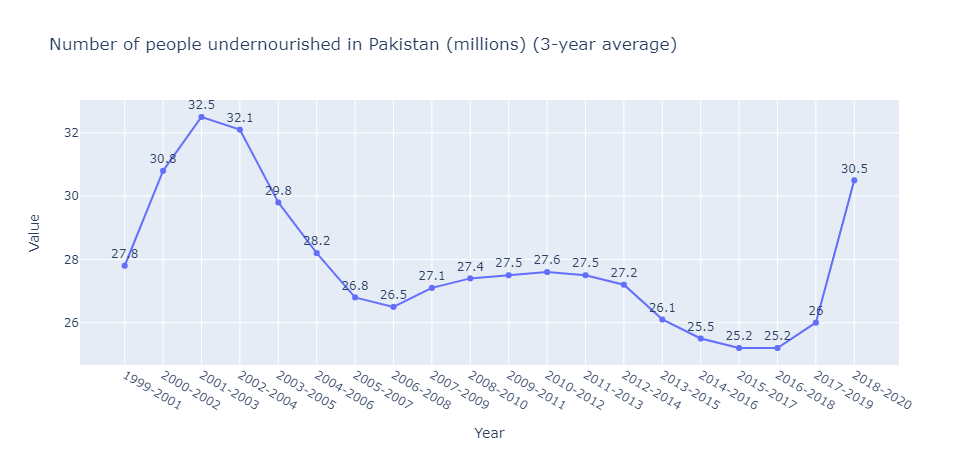

># Hello, welcome here!!
# Analysis of  Hunger and food insecurity Situation in Pakistan.

## -Data Contaions information from year (2000 to 2020)

## I have collected data set from the offical website of Food and Agriculture of Organization of UNO.
### After applying Data Cleaning and Data Wrangling techniques i draw impotant insightes from data.
### Below i have attached the Graph which show the analysis of data.

